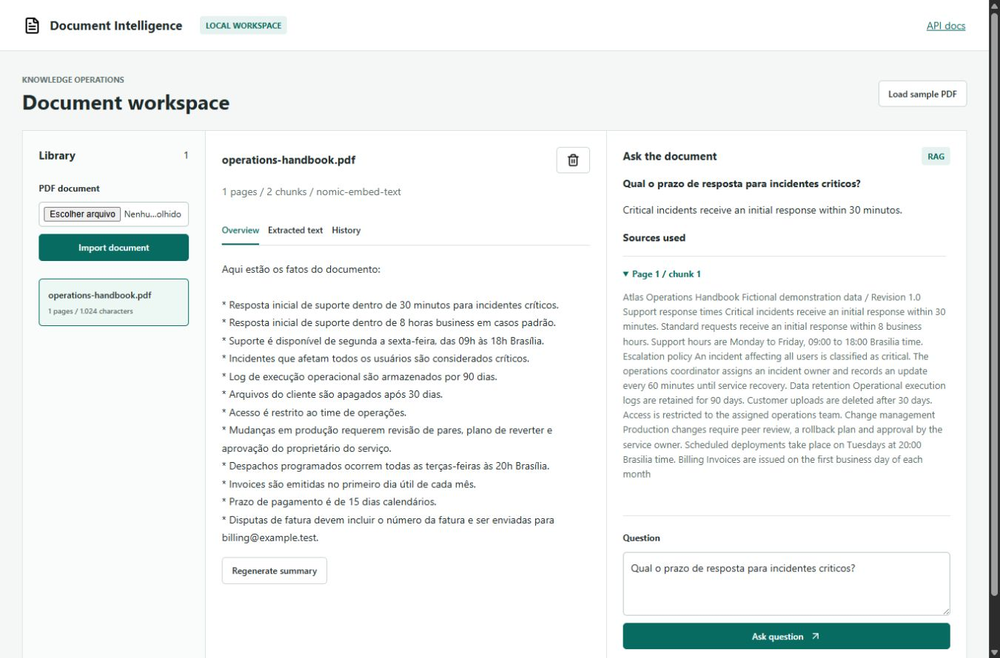

# AI Document Intelligence

A local-first document workspace: ingest PDFs, inspect extracted text, generate summaries and ask questions with traceable source excerpts. Built by [Thierry Azevedo](https://github.com/ThierryDev499).



[Mobile screenshot](docs/mobile.jpg)

## Problem

Finding operational information inside PDFs often requires repeated manual reading. This application indexes document passages and retrieves the relevant context before asking a local language model for an answer. Every accepted citation refers to a real chunk in the selected document.

## Implemented

- PDF signature, size, page-count, encryption and text-layer validation.
- Page-aware chunks (900 characters, 150-character overlap).
- Real local embeddings through Ollama; normalized vectors persisted in SQLite.
- Exact cosine retrieval using NumPy, isolated by document, followed by local LLM generation.
- JSON-schema constrained answers; citation IDs are validated before persistence.
- Summary generation across the complete document with hierarchical reduction.
- Question history, extracted-text inspection and document deletion.
- Responsive workspace, loading/error states, OpenAPI, request timing logs and automated tests.

No paid API, account or key is required. First-time model downloads require internet access. PDF contents are sent only to the configured Ollama host; the default is loopback. Do not configure a third-party host for confidential documents.

## Run locally

Prerequisites: Python 3.11+, [Ollama](https://ollama.com/) and approximately 3 GB for the two default models, plus runtime memory. CPU inference works but may be slow.

```sh
ollama pull llama3.2:3b
ollama pull nomic-embed-text
python -m venv .venv
# Windows: .venv\Scripts\activate
# macOS/Linux: source .venv/bin/activate
pip install -r requirements.lock
uvicorn app.main:app --host 127.0.0.1 --port 8101
```

Open http://127.0.0.1:8101. Click **Load sample PDF** to index the fictional Atlas operations handbook, then ask `Qual o prazo de resposta para incidentes criticos?`. The handbook specifies **30 minutes**. Generate a summary or inspect the chunks through the document tabs.

Optional `.env` settings are listed in `.env.example`: `OLLAMA_URL`, `CHAT_MODEL`, `EMBED_MODEL`, `DATA_DIR`. Changing the embedding model requires reimporting documents. No `.env` file is committed.

## Architecture

```text
Browser -> FastAPI -> pypdf -> page-aware chunks
                         -> Ollama embeddings -> SQLite vectors
Question -> embedding -> cosine top-4 -> Ollama chat -> validated sources
                                                  -> SQLite question history
```

The vector store is intentionally small and transparent: SQLite persists dense vectors as JSON and NumPy performs exact search. This is not FAISS or an approximate nearest-neighbor service. For large corpora, replace retrieval with a dedicated vector index.

```text
app/         API, persistence, PDF parsing, local-model client
web/         Browser UI and vendored Lucide icons
examples/    Fictional PDF and API examples
scripts/     Reproducible sample-document generator
tests/       Isolated API tests using a fake model at the network boundary
```

## API

Interactive documentation: http://127.0.0.1:8101/docs

| Method     | Endpoint                        | Purpose                                                      |
| ---------- | ------------------------------- | ------------------------------------------------------------ |
| GET        | `/api/health`                   | Application/model configuration, not a model readiness probe |
| GET/POST   | `/api/documents`                | List/import PDFs                                             |
| POST       | `/api/documents/sample`         | Import the included fictional PDF                            |
| GET/DELETE | `/api/documents/{id}`           | Inspect/delete a document and its history                    |
| POST       | `/api/documents/{id}/summary`   | Generate/persist a local summary                             |
| POST       | `/api/documents/{id}/questions` | Retrieve evidence and generate an answer                     |

```sh
curl -F "file=@examples/operations-handbook.pdf" http://127.0.0.1:8101/api/documents
curl -X POST http://127.0.0.1:8101/api/documents/DOCUMENT_ID/questions \
  -H "Content-Type: application/json" \
  -d '{"question":"Qual o prazo de resposta para incidentes criticos?"}'
```

The answer includes `answer`, `sources` (chunk ID, page, text and similarity), `model` and `created_at`. A missing document returns 404; invalid PDFs return 422; oversized files return 413; Ollama failures return 503; invalid model output returns 502. Model-generated text is rendered as text, never executable HTML.

## Validation

```sh
python -m pytest -q
python scripts/make_sample.py
```

Tests cover invalid PDFs, ingestion atomicity, deletion isolation, citation validation, history, summaries, model changes and JavaScript MIME types on Windows. Unit tests do not download models or claim to validate model quality. GitHub Actions runs the same suite. A live Ollama smoke test is documented in `docs/verification.md`.

## Docker

With Docker Engine and host Ollama running: `docker compose up --build`. The application binds to loopback on port 8101 and stores data in a named volume. On Linux, Ollama must be reachable from the Docker bridge; do not expose its port publicly. Local container execution has not been validated when Docker Engine is unavailable.

## Limits and security

- Local single-user application, without authentication. Do not expose it publicly without authentication, TLS, quotas and tenant isolation.
- Up to 10 MB, 50 pages and 100,000 extracted characters per PDF. No OCR for scanned PDFs; no image interpretation.
- Parsing and inference run in a thread pool; there is no durable background ingestion queue.
- LLM answers can be incorrect. Valid source IDs prove provenance, not factual entailment. Review the displayed excerpts.
- Documents may contain prompt injection. Context is marked as untrusted and the model has no tools, but this is not a guarantee against misleading answers.
- Original PDFs are not retained; extracted text, vectors and question history are stored locally. Deletion removes these records.
- No fabricated commercial results, customer information or public hosted AI demo.

Model APIs follow the official [Ollama embedding](https://docs.ollama.com/api/embed) and [structured-output](https://docs.ollama.com/capabilities/structured-outputs) contracts. Icons: Lucide ISC license in `web/LUCIDE-LICENSE`.
